ESPOL Software Engineering II - Coding Standards Workshop
Lab report | Python | 2026-10-08 | Ecuador UTC-5

Lab report | Python | 2026-10-08 | Ecuador UTC-5

# Introduction

This workshop refactors a deliberately faulty Python student-grade program into a working terminal application, while preserving the initial source and comparing authentic initial and final HTML coding-standards reports.

Python was selected for its readable syntax and standard-library support. Flake8 was selected as a lightweight, reproducible command-line checker that works with a VS Code workflow. The flake8-html plugin provides reviewable HTML snapshots. Pinned direct tool versions are Flake8 7.4.1 and flake8-html 0.4.3; local Python is 3.11.9.

The initial enabled checks found one F841 unused-variable warning, not every functional defect. Therefore linting was combined with manual code review, unit tests, and real subprocess CLI exercises. Zero lint findings alone does not prove that a program meets its requirements.

## Repository and submission status

[https://github.com/Sam-24-dev/coding-standards-workshop](https://github.com/Sam-24-dev/coding-standards-workshop)

[Published original commit b6261a9](https://github.com/Sam-24-dev/coding-standards-workshop/commit/b6261a990d2c92d57d6d411113817c3b0c7b4a73)

At report preparation, the public repository contains the original baseline. The final implementation, reports, screenshots, workflow, and this PDF are prepared locally; final publication awaits the user's file-review approval. The repository links above are current public links. Relative artifact paths in this report refer to the prepared submission, not already-uploaded files.

Canvas accepts PDF only. docs/lab-report.pdf is the primary submission. The original and final HTML reports with their assets remain separate supplementary repository artifacts; screenshots do not replace them.

# Development

## 1. Preserve and publish the original baseline

The original test.py was committed and published before refactoring. A literal copy remains at original/test.py. Its 42-line source SHA256 is 2049753365204B1D6BF7E02CEF0A0A15A8709213D0D2EC59740831867D845786. The archive is intentionally excluded from active final lint and test scopes so its preserved defects are not silently corrected or suppressed.

## 2. Run the initial tool and inspect runtime behavior

The unchanged baseline produced one F841 finding: local variable avg was assigned but never used. Flake8 exited 1, as expected for a finding. The initial HTML snapshot is reports/initial/index.html, with linked source, finding-detail, stylesheet, and SVG assets preserved unchanged.

Executing the original stopped with TypeError because a text grade, Fifty, was added and then accumulated with numbers. That observed error precedes other defects: average division is always by zero if reached, no average is returned, calcAverage does not match calcaverage, honor is not boolean, letter/status logic is absent, summary fields are invalid or missing, and deletion lacks bounds or missing-value handling.

The public runtime derivative evidence/public/phase-2-original-runtime.txt redacts private absolute paths and declares that transformation and the raw source hash. The local raw capture remains unchanged. The privacy-redacted version record is evidence/public/tool-versions.txt.

## 3. Refactor the application and check manually

Student replaces the inconsistent class and method names with PEP 8 naming. Fixed business rules are named MIN_GRADE, MAX_GRADE, PASS_THRESHOLD, HONOR_THRESHOLD, and LETTER_THRESHOLDS rather than repeated magic values. The application uses only the Python standard library and does not add layers or an application dependency.

The constructor strips and validates nonempty string IDs and names. Mutators validate real numeric grades from 0 to 100, rejecting text, bool, NaN, infinity, and out-of-range values. The CLI converts numeric input before validation, catches expected ValueError messages, and exits gracefully on EOF or keyboard interrupt without hiding unexpected exceptions.

Grades are exposed as a tuple so callers cannot append unvalidated values. Average, letter, pass/fail, and honor are recomputed from current grades. Empty lists yield average None (display N/A), letter N/A, Not graded, and honor False. Value removal deletes only the first duplicate; index removal uses explicit zero-based, nonnegative integers. Invalid removals leave data unchanged.

## Development - all nine functional requirements

| # | Requirement | Implementation | Verification |
|---|---|---|---|
| 1 | Create students | Student constructor and CLI create action | Valid IDs/names, whitespace stripping, empty/non-string rejection, independent students |
| 2 | Add numeric grades | add_grade and shared grade validation | 95.0, 72.5, 0, 100; reject text, bool, NaN, infinity and invalid range |
| 3 | Calculate average | average property | All four grades average 66.875; empty average None |
| 4 | Determine letter | letter_grade and LETTER_THRESHOLDS | 0, 59, 60, 69, 70, 79, 80, 89, 90, 100 and just-below decimals |
| 5 | Determine pass/fail | status and PASS_THRESHOLD | Below 60 Failed; at 60 Passed; empty Not graded |
| 6 | Handle invalid input | Constructor/mutators and CLI error boundary | Clear error recovery; missing student; duplicate ID; EOF/interrupt |
| 7 | Boolean honor roll | honor_roll and HONOR_THRESHOLD | At 90 True; below 90 False; freshly recalculated after removal |
| 8 | Remove value/index | remove_grade_by_value / remove_grade_by_index | First duplicate only; missing/empty; negative, bool and invalid indices |
| 9 | Formatted summary | report and CLI summary action | All seven fields; exact decimal report; ungraded and subprocess output |

Letter thresholds are continuous: A >= 90, B >= 80, C >= 70, D >= 60, F < 60. 59.99, 69.99, 79.99 and 89.99 remain below their next bands. Classification uses the actual average before two-decimal display rounding.

The formatted summary includes Student ID, Student Name, Number of Grades, Average Grade, Letter Grade, Pass/Fail, and Honor Roll. A real CLI exercise with grades 95 and 72.5 shows average 83.75, B, Passed, and False honor. Removing both grades shows N/A and Not graded.

## Development - tests and final coding-standards report

4. Functional verification: python -m unittest discover -s tests -v passed 21 unittest methods. subTest boundary iterations are not separate test counts. Real subprocess tests exercise normal creation/add/removal/summary, multiple students, invalid choices and inputs, and EOF. Keyboard interrupt is tested with an input mock. Coverage percentage was not measured.

Verbatim final output summary: Ran 21 tests in 0.600s; OK.

5. Final analysis: python -m flake8 --isolated test.py tests --format=html --htmldir=reports/final --htmlpep8 true --statistics exited 0. The explicit true value is required by flake8-html 0.4.3. The genuine generated index says No flake8 errors found in 2 files scanned.

The initial finding count changed from 1 to 0. Runtime and logic fixes are additional functional improvements, not additional observed lint findings. The clean plugin generated index.html, styles.css, and SVG assets; it did not generate per-file error pages, and none were fabricated.

The final lint capture evidence/phase-5-final-lint.txt is intentionally empty because successful stdout and stderr were both empty. evidence/verification-metadata.json records exact commands, exit codes, and byte counts separately. Final tests were rerun after naming the business constants.

## 6. Prepare the optional workflow challenge

.github/workflows/coding-standards.yml declares pull_request targeting main and workflow_dispatch, contents: read, ubuntu-latest, and Python 3.11. It installs requirements-dev.txt, runs python -m flake8 --isolated test.py tests, then python -m unittest discover -s tests -v.

Official checkout v6 and setup-python v7 tags were resolved via read-only GitHub API calls and pinned to immutable action SHAs with version comments. Local PyYAML parsing and assertions checked triggers, main branch, permission, runner, Python version, and intended commands. This is not an actionlint check or proof of an actual GitHub run.

Remote publication and remote CI execution are PENDING approval. No workflow run, successful pull-request trigger, or CI pass is claimed. After approval, publish the prepared files and inspect a real manual run.

## Evidence authenticity

The following numbered figures are genuine screenshots. Browser views of saved tool output are identified as such; they are not native-terminal screenshots or recreated terminal panels. The narrow VS Code source image is a direct screen-region capture excluding unrelated panes, without retouching. Images are embedded unmodified with aspect ratio preserved. Wider or larger evidence pages preserve readability. Host HTML timestamps are UTC+1; Ecuador is UTC-5. Generated timestamps and images were not rewritten.

## Development - evidence 1

The public repository page establishes the genuine original publication; later deliverables still await final release approval.

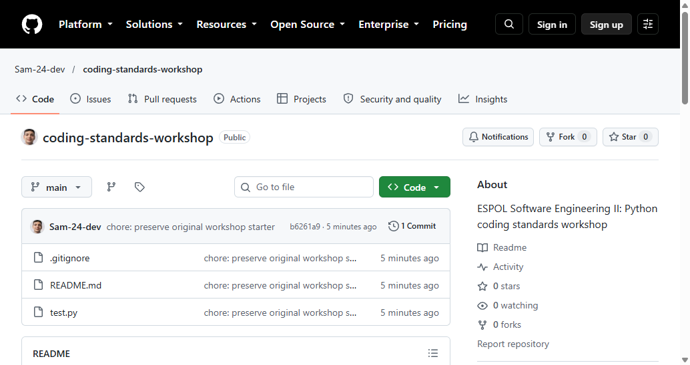

Figure 1. Published public repository before refactoring.

## Development - evidence 2

The original commit provides a durable before-change reference. The archived source remains byte-identical to that initial source.

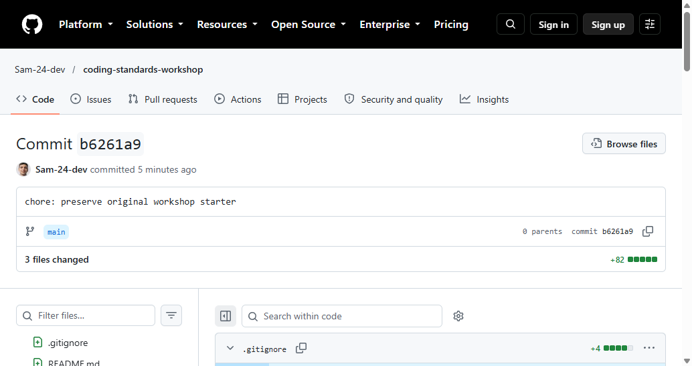

Figure 2. Published original baseline commit.

## Development - evidence 3

The initial HTML index records one enabled-check finding on the unchanged baseline, not a complete count of functional defects.

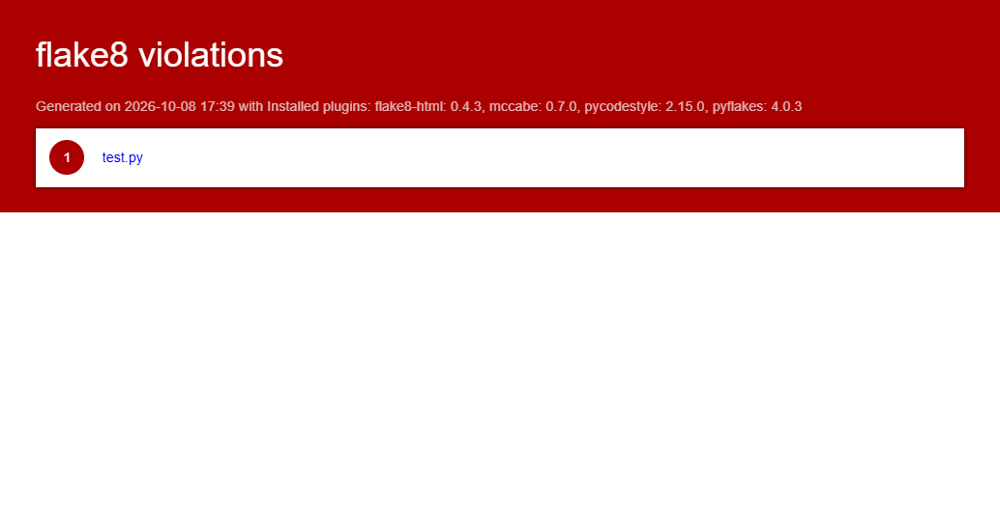

Figure 3. Initial generated Flake8 HTML index.

## Development - evidence 4

The detail page identifies the actual lint issue. Manual inspection and runtime testing were still needed for missing behaviors.

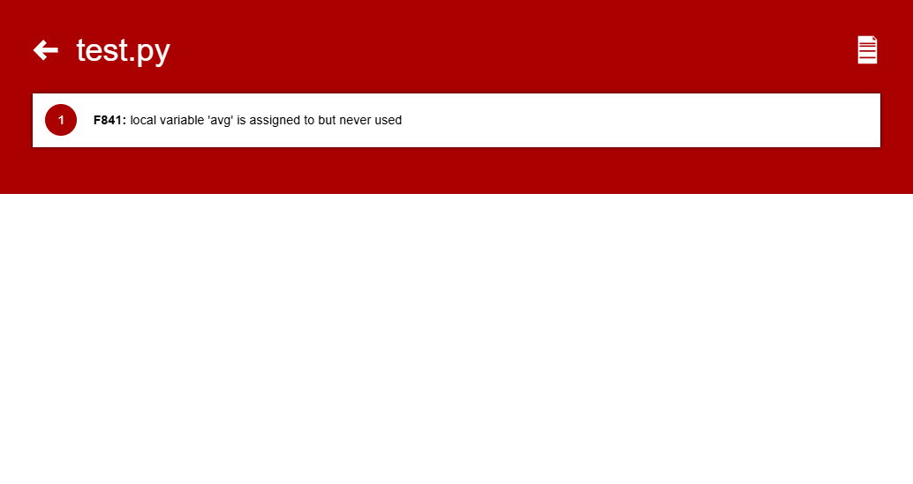

Figure 4. Initial finding detail: unused local variable avg (F841).

## Development - evidence 5

This is a screenshot of saved command output, not a direct native-terminal capture. Exit 1 corresponds to the genuine finding.

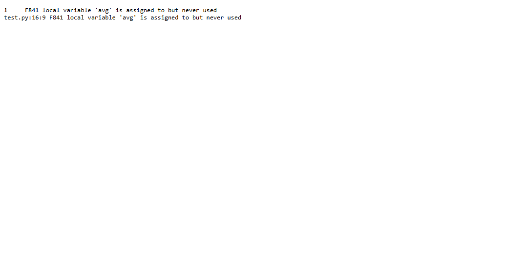

Figure 5. Actual initial lint output displayed in a browser.

## Development - evidence 6

This genuine 505 by 650 screen-region capture shows the source editing context; the full source and tests are retained separately.

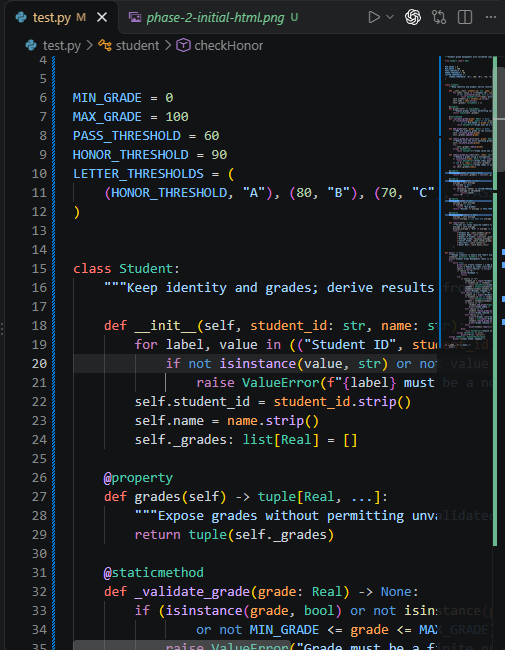

Figure 6. Refactored Student source and named thresholds in VS Code.

## Development - evidence 7

The functional suite passes 21 methods; multiple subTest iterations do not inflate that count. The original captured text is retained.

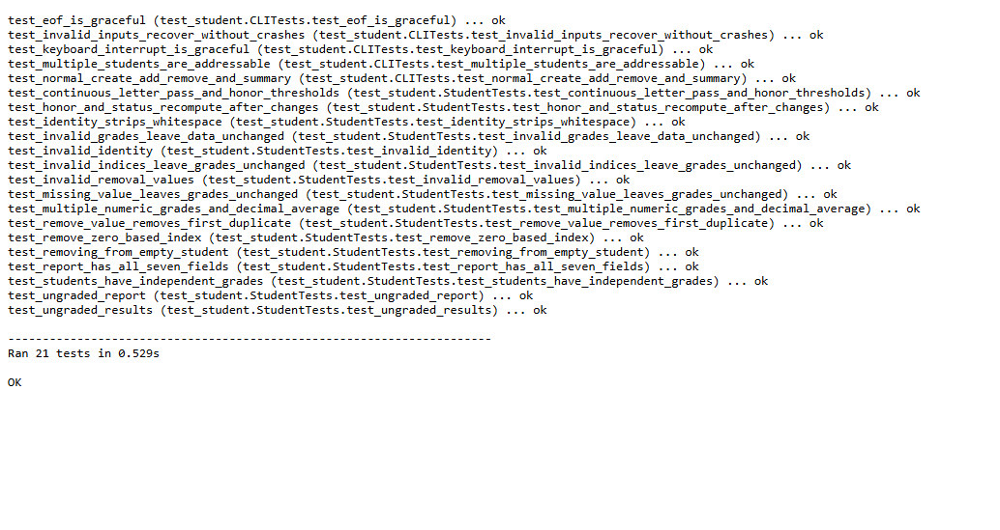

Figure 7. Actual saved unittest output displayed in a browser.

## Development - evidence 8

The subprocess transcript shows creation, numeric grades, the 83.75 summary, both removal kinds, ungraded output, and recoverable invalid inputs.

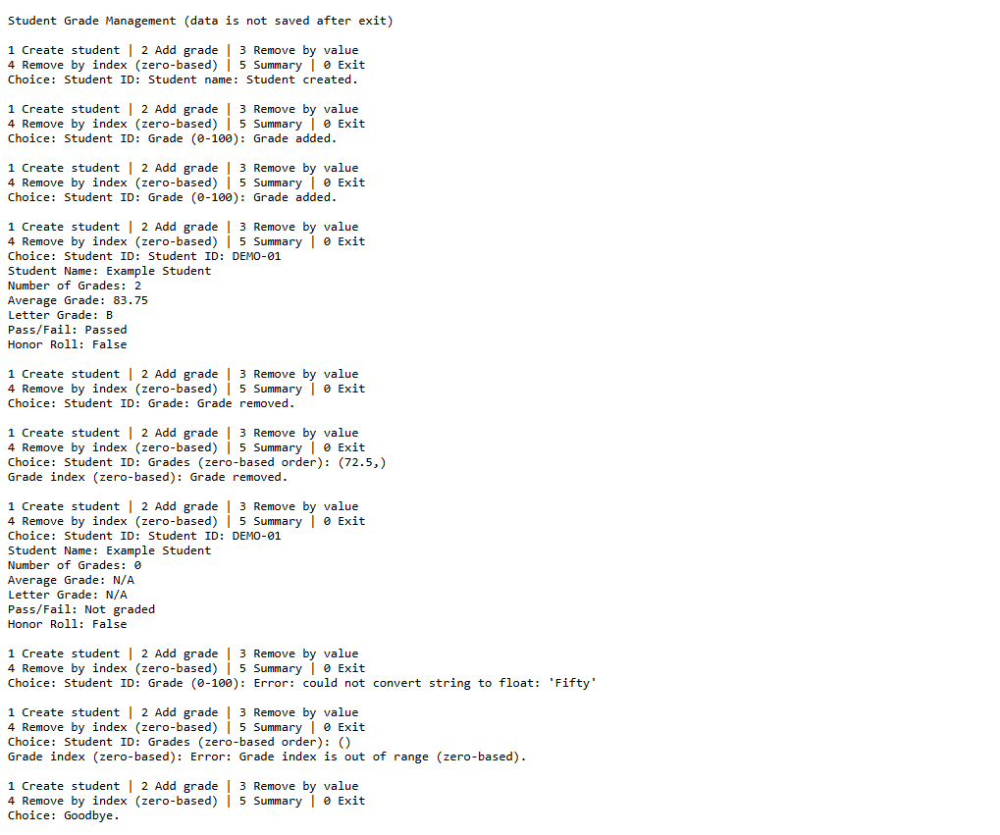

Figure 8. Real CLI transcript displayed in a browser.

## Development - evidence 9

The final report explicitly scans the active source and tests. The deliberately faulty original archive is outside that active scope.

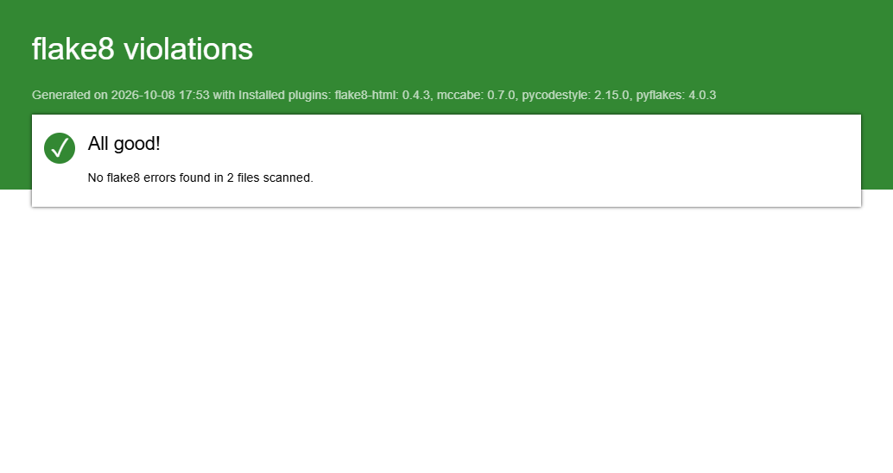

Figure 9. Final generated HTML index with no findings.

## Development - evidence 10

The metadata records final lint exit 0 with zero stdout/stderr bytes and final test exit 0. It complements the intentionally empty lint text file.

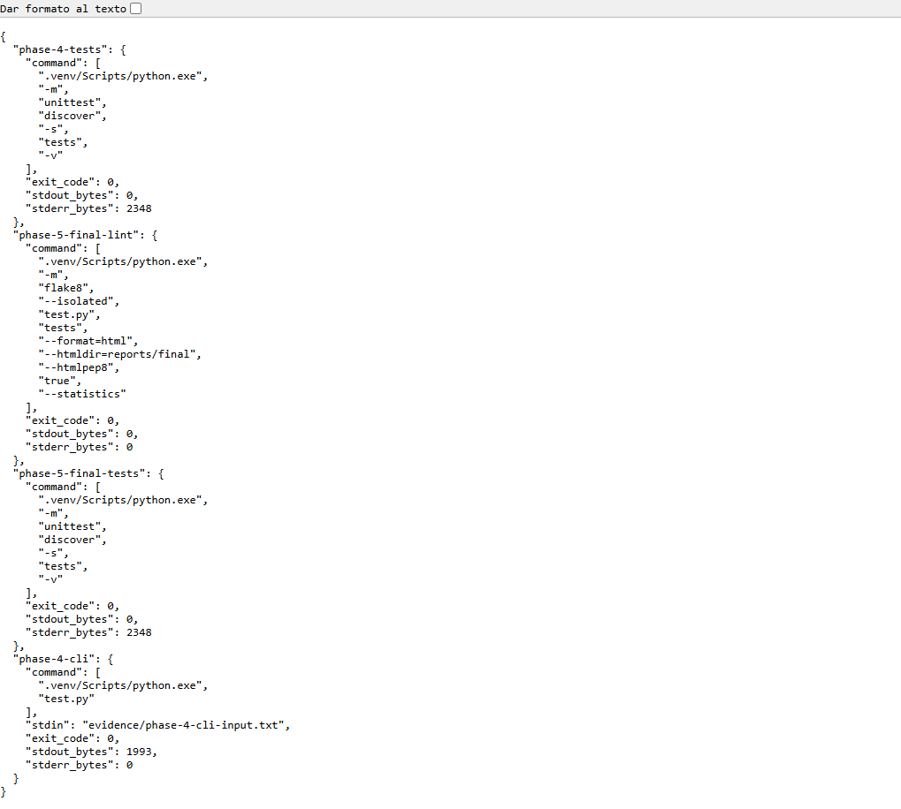

Figure 10. Authentic verification metadata displayed in a browser.

## Development - evidence 11

The genuine saved local validation result confirms YAML checks and local commands only; no remote GitHub run is represented.

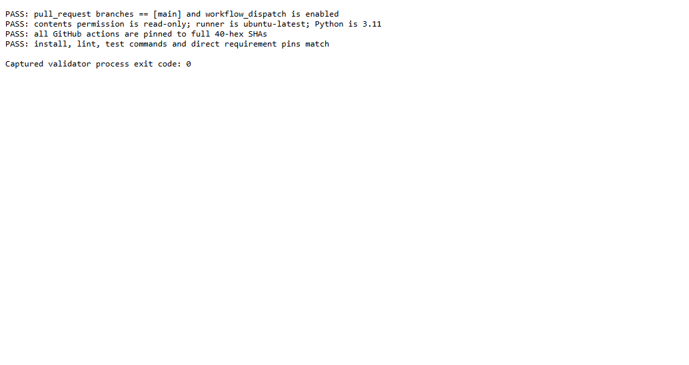

Figure 11. Local workflow validation evidence.

# Conclusions

The preserved original program failed during numeric accumulation. The completed local program implements all nine required behaviors, validates trust-boundary inputs, uses meaningful PEP 8 names and named business thresholds, and derives results from current grades without stale cached status.

Observed local evidence consists of one initial F841 finding, zero final findings across two active files, 21 passing unittest methods, and a successful real CLI exercise. This combination is stronger than linting alone, but it does not establish a measured coverage percentage or production readiness.

The initial and final HTML reports are preserved as distinct artifacts with their assets. The PDF includes process figures, requirement traceability, repository links, and clear evidence boundaries. Final repository publication requires user approval; remote CI remains unverified until the workflow is published and an actual run is inspected.

This teaching application keeps student data only in memory. IDs are case-sensitive and unique within a CLI session; no personal student dataset is used in demonstration evidence. There is no disk persistence, database, GUI, export facility, or guarantee of a particular rubric score.

# Recommendations

Retain the pinned lint commands, behavioral tests, and manual review together. Run them after future edits and keep initial/final report scopes explicit. Do not treat a clean Flake8 output as proof that every business rule works.

After reviewing the final file summary and approving publication, verify the remote workflow through an actual GitHub run. Record its URL and real result before claiming the optional CI challenge has executed successfully. Until then, preserve the explicit PENDING status.

Submit docs/lab-report.pdf to Canvas. Once publication is approved, keep the application, tests, original archive, HTML reports, screenshots, and captured logs available in the repository for reproducibility. Privacy-redacted public derivatives should remain clearly marked, while local raw evidence remains unchanged and excluded from publication.

Add persistence or other capabilities only if a future requirement needs them; that would require fresh validation and tests. For this workshop, the small standard-library implementation is sufficient.
